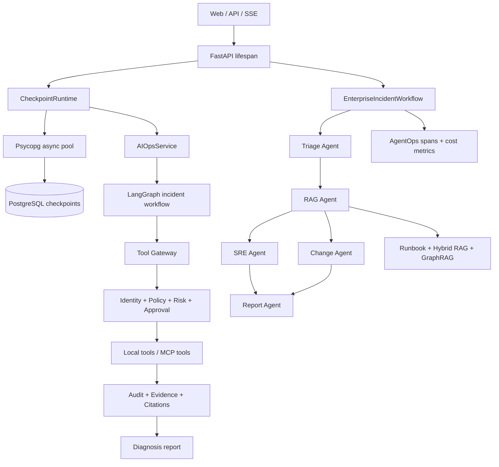

# SpatialSRE-Agent

> 面向企业故障响应场景的可恢复、可审计、权限可控的多 Agent SRE 平台。

[](https://www.python.org/)
[](https://fastapi.tiangolo.com/)
[](https://langchain-ai.github.io/langgraph/)
[](https://www.postgresql.org/)
[](docs/learning/README.md)

SpatialSRE-Agent 将传统的 RAG + AIOps 原型升级为 Incident Response Agent Platform：以 `incident_id` 隔离故障，以 PostgreSQL checkpoint 保存 LangGraph 状态，通过统一 Tool Gateway 执行工具，并在同一链路中提供身份、策略、审批、证据、回放和 AgentOps 数据。

## 核心能力

| 领域 | 已落地能力 |
| --- | --- |
| Durable Runtime | `incident_id -> thread_id`、PostgreSQL checkpoint、连接池生命周期、跨进程恢复、已完成节点不重复执行 |
| 受控工具执行 | 本地/MCP 统一 Tool Gateway、调用审计、超时与错误归一、风险等级、强制 dry-run |
| 身份与策略 | Agent Identity、工具/服务/风险范围、Policy-as-Code、默认拒绝式安全边界 |
| 人类审批 | 高风险工具调用可中断，审批请求随 checkpoint 持久化，批准或拒绝后恢复原故障流程 |
| 证据护栏 | 输入校验、真实工具结果转 evidence、稳定 citation、最终报告只能引用可追溯证据 |
| Runbook 与变更 | 5 类 Runbook-as-Code，基于服务、依赖、时间和环境关联发布、配置、Git、K8s 变更 |
| 检索增强 | Query Rewrite、BM25 + 向量 RRF、Rerank、元数据过滤、检索评测、Hybrid RAG + GraphRAG |
| Incident Graph | 服务依赖、影响范围、关联变更、相似故障查询，局部子图与全局摘要融合 |
| Replay / EvalOps | 版本化故障集、工具轨迹 Precision/Recall/F1、Failure Replay、幻觉/延迟/成本指标 |
| 多 Agent 编排 | Triage、RAG、SRE、Change、Report 五角色，SRE/Change 并行执行并支持失败隔离 |
| AgentOps | OpenTelemetry span、`trace_id`、角色延迟、成功状态、模型 token 与成本记录 |

基础能力仍包括 Web 对话、SSE 流式响应、文档上传、Milvus 向量检索、DashScope 模型和 MCP 日志/监控工具。

## 架构



关键标识语义：

- `incident_id`：持久化工作流的唯一故障标识，对应 LangGraph `thread_id`。
- `trace_id`：一次诊断执行链路，用于审计、证据和 AgentOps 关联。
- `session_id`：用户会话标识，不承担故障状态隔离职责。

## 快速开始

### 环境要求

- Python `3.11 - 3.13`
- [uv](https://docs.astral.sh/uv/)
- Docker Desktop / Docker Engine
- DashScope API Key
- Node.js（仅腾讯云 CLS MCP 服务需要）

### 1. 克隆与安装

```bash
git clone https://github.com/zebstr427-dev/SpatialSRE-Agent.git
cd SpatialSRE-Agent

uv sync --extra dev
```

### 2. 配置环境变量

Linux/macOS：

```bash
cp .env.example .env
```

Windows PowerShell：

```powershell
Copy-Item .env.example .env
```

至少将 `.env` 中的 `DASHSCOPE_API_KEY` 替换为本地密钥。不要提交真实密钥。

### 3. 启动基础设施

```bash
# LangGraph PostgreSQL checkpoint store，默认监听 127.0.0.1:5433
docker compose -f compose.postgres.yml up -d

# Milvus 向量数据库，默认监听 localhost:19530
docker compose -f vector-database.yml up -d
```

### 4. 启动服务

```bash
uv run python -m app.run
```

Windows 也可以使用：

```powershell
.\start-windows.bat
```

服务入口：

- Web UI：<http://localhost:9900>
- OpenAPI：<http://localhost:9900/docs>
- 健康检查：<http://localhost:9900/health>

## 端到端故障响应演示

项目提供不依赖 LLM 或外部 MCP 的可复现演示，用于展示五个 Agent 协作、Runbook、变更关联、GraphRAG、证据链和 AgentOps 数据：

```bash
uv run python -m app.demo
```

输出包含 `incident_id`、`trace_id`、角色执行结果、证据、根因、修复建议、最终报告、Agent span 和成本指标。

## API

| 方法 | 路径 | 说明 |
| --- | --- | --- |
| `POST` | `/api/chat` | 普通 RAG 对话 |
| `POST` | `/api/chat_stream` | SSE 流式对话 |
| `POST` | `/api/upload` | 上传并索引知识文档 |
| `POST` | `/api/aiops` | 启动 durable AIOps SSE 诊断 |
| `GET` | `/api/incidents/{incident_id}` | 查询故障的最新持久化状态 |
| `POST` | `/api/incidents/{incident_id}/approval` | 批准或拒绝等待中的高风险工具调用 |
| `POST` | `/api/enterprise/incidents` | 运行结构化五角色企业故障工作流 |
| `GET` | `/health` | 检查 Milvus 与 checkpoint store 状态 |

### Durable AIOps

```bash
curl -N -X POST "http://localhost:9900/api/aiops" \
  -H "Content-Type: application/json" \
  -d '{
    "session_id": "session-123",
    "incident_id": "incident-payment-cpu-001",
    "alert": {
      "alert_name": "HighCPUUsage",
      "service": "payment",
      "severity": "warning"
    }
  }'
```

### 人类审批

```bash
curl -X POST "http://localhost:9900/api/incidents/incident-payment-cpu-001/approval" \
  -H "Content-Type: application/json" \
  -d '{
    "approved": true,
    "decided_by": "oncall-engineer",
    "reason": "变更窗口内允许执行"
  }'
```

### 企业多 Agent 工作流

```bash
curl -X POST "http://localhost:9900/api/enterprise/incidents" \
  -H "Content-Type: application/json" \
  -d '{
    "input": "Diagnose payment CPU 100% after deployment",
    "incident_id": "incident-payment-cpu-001",
    "alert": {
      "alert_name": "HighCPUUsage",
      "service": "payment",
      "severity": "warning",
      "environment": "production"
    }
  }'
```

## 项目结构

```text
app/
├── agent/                 # Durable Agent、Tool Gateway、策略、审批、证据和多 Agent 工作流
├── api/                   # Chat、AIOps、incident、approval、enterprise API
├── core/                  # PostgreSQL checkpoint runtime、LLM、Milvus
├── evals/                 # 版本化评测加载器与指标 runner
├── incident_graph/        # Incident Graph、图查询与 GraphRAG
├── replay/                # Failure Replay 与质量/成本指标
├── retrieval/             # Query Rewrite、Hybrid Retrieval、Rerank、过滤
├── services/              # AIOps、RAG、向量服务
└── tools/                 # 本地工具与变更/知识/监控工具

docs/learning/             # P0-P3 共 31 个可复现课程与验收记录
evals/incident_cases.jsonl # 版本化故障评测集
policies/                  # Policy-as-Code
runbooks/                  # 版本化 Runbook-as-Code
tests/                     # 单元测试与 PostgreSQL 集成测试
compose.postgres.yml       # Checkpoint PostgreSQL
vector-database.yml        # Milvus
```

## 测试与质量

```bash
# 不依赖真实 PostgreSQL 的测试
uv run pytest -m "not postgres" -q

# 真实 PostgreSQL checkpoint 集成测试
uv run pytest -m postgres -q

# 静态检查
uv run ruff check app tests

# 端到端故障响应验收
uv run python -m app.demo
```

P0-P3 验收基线（2026-08-05）：

- 非 PostgreSQL：`115 passed`
- PostgreSQL 集成测试：`2 passed`
- 完整测试集：`117 passed`
- 应用代码覆盖率：`64.34%`

完整的实现过程、测试证据和面试叙事见 [P0-P3 学习路线](docs/learning/README.md)。

## 主要配置

| 环境变量 | 默认值 | 用途 |
| --- | --- | --- |
| `DASHSCOPE_API_KEY` | 无 | DashScope 模型密钥 |
| `DASHSCOPE_MODEL` | `qwen-max` | 主对话模型 |
| `CHECKPOINT_DATABASE_URL` | `postgresql://...@127.0.0.1:5433/oncall_agent` | LangGraph checkpoint 数据库 |
| `CHECKPOINT_POOL_MIN_SIZE` | `1` | PostgreSQL 最小连接数 |
| `CHECKPOINT_POOL_MAX_SIZE` | `10` | PostgreSQL 最大连接数 |
| `CHECKPOINT_AUTO_SETUP` | `true` | 启动时初始化 checkpoint schema |
| `MILVUS_HOST` | `localhost` | Milvus 地址 |
| `MILVUS_PORT` | `19530` | Milvus 端口 |
| `RAG_TOP_K` | `3` | RAG 返回数量 |
| `MCP_CLS_URL` | `http://localhost:8003/mcp` | CLS MCP 地址 |
| `MCP_MONITOR_URL` | `http://localhost:8004/mcp` | Monitor MCP 地址 |

## 常见问题

### 服务启动时无法连接 Milvus

```bash
docker compose -f vector-database.yml ps
docker compose -f vector-database.yml restart standalone
```

### PostgreSQL checkpoint 不健康

```bash
docker compose -f compose.postgres.yml ps
docker compose -f compose.postgres.yml logs postgres
```

### Windows 下项目自带虚拟环境不可用

虚拟环境不应在不同用户或机器之间复制。删除失效的 `.venv` 后，在当前项目目录重新执行：

```powershell
uv sync --extra dev
```

## 参考资料

- [FastAPI](https://fastapi.tiangolo.com/)
- [LangGraph](https://langchain-ai.github.io/langgraph/)
- [Model Context Protocol](https://modelcontextprotocol.io/)
- [OpenTelemetry](https://opentelemetry.io/)
- [Milvus](https://milvus.io/)

## License

MIT - author: chief
