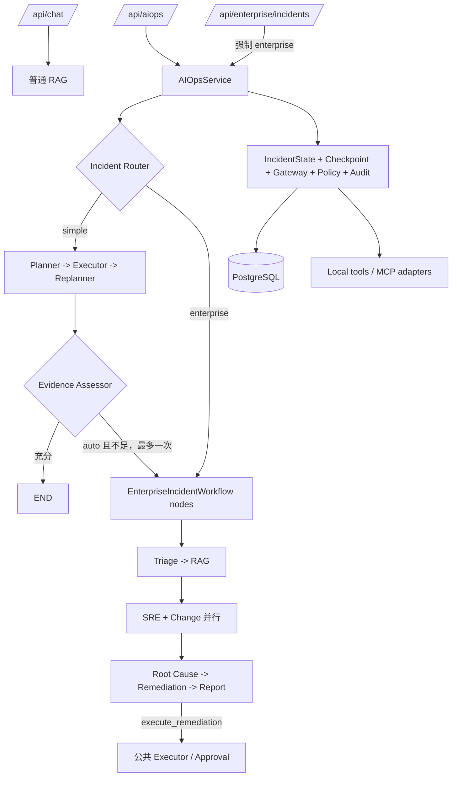

# SpatialSRE-Agent 生产级架构升级与验收说明

> 文档状态：已实现并通过验收
>
> 运行基线：Python 3.13.15、LangGraph 1.x、PostgreSQL 18.6、FastAPI
>
> 核心结论：所有故障请求由单一 Durable Incident Runtime 承载，Simple 与 Enterprise 是同一父图中的两种诊断策略。

## 1. 完成态架构



架构只有两条顶层业务链：

1. 普通 `/api/chat`：轻量问答、知识检索和会话记忆，不承担故障执行。
2. Durable Incident Runtime：承载 `/api/aiops` 与企业兼容入口，统一负责路由、诊断、审批、持久化和审计。

`EnterpriseIncidentWorkflow` 不拥有独立生产图。它通过 `register_nodes()` 向
`AIOpsService` 的父图提供企业节点；兼容 `run()` 仅用于直接调用与测试包装。

## 2. 单一父图的工程约束

`AIOpsService` 只编译一张 `StateGraph(IncidentState)`，并将同一个 Checkpointer
传给父图。该约束保证：

- Simple 与 Enterprise 使用同一状态 schema，不存在跨工作流复制和映射。
- LangGraph 在每个父图节点后保存 checkpoint，企业 Agent 也具备节点级恢复能力。
- 高风险工具统一进入公共 `executor -> approval -> executor` 恢复路径。
- `routing_history`、`evidence`、`tool_calls` 和 `policy_decisions` 形成完整审计链。
- SRE 与 Change 在同一 superstep 并行，汇合后才进入 Root Cause。

## 3. 统一 IncidentState v2

| 字段 | 语义 |
| --- | --- |
| `workflow_version` | 新请求为 `2`；缺失时按 v1 Simple 状态兼容读取 |
| `requested_strategy` | 客户端请求的 `auto/simple/enterprise` |
| `selected_strategy` | Router 最终选择的策略 |
| `routing_history` | 初始路由、动态升级、原因码和时间 |
| `diagnosis_confidence` | Simple 证据评分，范围 `[0, 1]` |
| `escalation_count` | 动态升级次数，上限为 1 |
| `provider_failures` | Provider 失败角色、原因与时间 |
| `evidence` | 带来源、采集时间和稳定 ID 的证据 |
| `tool_calls` | 工具参数、结果、状态、耗时和调用 ID |
| `policy_decisions` | 身份、风险与策略判定结果 |
| `agent_outputs` | Enterprise 各角色结构化输出 |

`EnterpriseState` 是 `IncidentState` 的兼容别名，代码中没有第二套状态模型。

## 4. 确定性路由

Router 不让 LLM 决定安全关键分支。规则按以下优先级执行：

1. 显式 `simple` 或 `enterprise` 直接覆盖自动判断。
2. `critical` 事故直接选择 Enterprise。
3. 多服务事故直接选择 Enterprise。
4. 明确要求 GraphRAG 或变更关联时选择 Enterprise。
5. `high + recent_change` 选择 Enterprise。
6. 其他 `auto` 请求先选择 Simple，以控制延迟和调用成本。

每次选择都会写入 `routing_history`，包括 `from_strategy`、`to_strategy`、
`reason_code`、`reason` 和时间戳。显式 Simple 不自动升级，Enterprise 不降级。

## 5. 证据评分与动态升级

Simple 结束时由 `evidence_assessor` 计算确定性置信度：

| 评分项 | 分值 |
| --- | ---: |
| 匹配到 Runbook | `+0.20` |
| 每种不同证据来源 | `+0.15`，最高 `+0.45` |
| 成功工具调用 1 次 | `+0.10` |
| 成功工具调用 2 次以上 | `+0.20` |
| 报告包含有效证据引用 | `+0.15` |
| 存在工具失败 | `-0.15` |
| 失败步骤达到 2 次 | 再 `-0.15` |

最终分数限制在 `[0, 1]`。`auto` 请求在下列任一条件成立时升级到 Enterprise：

- `diagnosis_confidence < 0.60`；
- 没有形成报告；
- 失败步骤达到 2 个。

升级只清理未完成计划、待审批调用和旧 response；Simple 已获得的 evidence、
tool audit、policy decision 与 past steps 全部保留。`escalation_count` 保证同一事故
最多升级一次。

## 6. Enterprise 策略

```text
enterprise_triage
  -> enterprise_rag
      -> enterprise_sre + enterprise_change
          -> enterprise_root_cause
              -> enterprise_remediation
                  -> executor / approval（可选）
                      -> enterprise_report
```

- Triage：确定影响范围、优先级与调查方向。
- RAG：组合 Runbook、Milvus/Hybrid RAG 与 Incident Graph 快照。
- SRE：经 Gateway 查询日志、指标和服务信号。
- Change：经 Gateway 查询变更，再执行时间、服务和依赖关联。
- Root Cause：只基于可追溯证据汇总候选根因。
- Remediation：默认生成建议；`execute_remediation=true` 时生成公共 Executor 计划。
- Report：输出结构化报告、引用、失败 Provider 和最终状态。

单个 Provider 失败不会终止其余角色。失败写入 `provider_failures`，最终状态为
`completed_with_partial_results`；系统不会使用硬编码 CPU、日志或变更数据替代失败结果。

## 7. 工具、安全与审批

所有 Incident 工具调用通过 `create_tool_gateway` 创建的请求级 Gateway：

- 工具注册、风险元数据和 Policy 实现共享。
- audit hook 按请求隔离，避免并发 Incident 串写审计。
- Identity 限制允许的工具、服务和最大风险级别。
- 未知工具按高风险处理，策略默认拒绝。
- 工具结果统一转换为 audit record 与 evidence。

`restart_service` 是受控 `write` 工具：

- 参数包含 `service`、`environment` 和 `dry_run`。
- production 调用需要 Operator 权限与人工审批。
- Gateway 强制 `dry_run=true`，不会在本项目中真实重启服务。
- 批准和拒绝都会通过 LangGraph `Command(resume=...)` 恢复原事故线程。

## 8. API 与 SSE

`/api/aiops` 请求支持：

```json
{
  "session_id": "session-123",
  "incident_id": "incident-payment-001",
  "input": "payment 发布后 CPU 持续升高",
  "strategy": "auto",
  "execute_remediation": false,
  "alert": {
    "alert_name": "HighCPUUsage",
    "service": "payment",
    "severity": "high",
    "recent_change": true
  }
}
```

SSE 保留 `plan`、`step_complete`、`report`、`approval_required` 与 `complete`，并增加：

- `routing`：初始选路和原因码；
- `escalation`：Simple 升级 Enterprise；
- `agent_update`：企业角色状态与 Provider 降级；
- 连续 `sequence`：保证前端按顺序渲染时间线。

`/api/enterprise/incidents` 将请求策略固定为 Enterprise 后调用同一个
`AIOpsService`，返回统一持久化状态。旧请求字段仍可使用，identity 与
`execute_remediation` 为扩展字段。

## 9. Web 控制台

AI Ops 使用独立配置面板，不复用普通聊天的快速/流式模式。界面支持：

- 故障描述、告警名、服务、严重度；
- Auto / Simple / Enterprise 策略选择；
- 策略徽标、路由原因和 Simple -> Enterprise 升级时间线；
- Enterprise 并行角色、Provider 失败和最终置信度；
- `approval_required` 卡片以及批准/拒绝结果；
- Observer 默认无权批准，Operator 按 identity 范围执行。

## 10. Checkpoint 兼容性

升级不要求数据库迁移：

- 缺失 `workflow_version` 的状态按 v1 Simple 读取。
- `planner`、`executor`、`replanner`、`approval` 节点名保持稳定。
- 恢复旧线程时遵循 checkpoint 中的 `next`，不会重新执行 Router。
- 企业审批在 `AIOpsService` 重建后从同一 `incident_id` 恢复。
- 已完成 Agent 节点不会重复调用 Provider。

## 11. 验收结果

验收环境：Windows、Python 3.13.15、PostgreSQL 18.6。

| 检查 | 结果 |
| --- | --- |
| 非 PostgreSQL pytest | `130 passed` |
| PostgreSQL integration | `2 passed` |
| 全量 pytest | `132 passed` |
| 应用代码覆盖率 | `66.42%` |
| Ruff | `0 errors` |
| Pyright | `0 errors` |

PostgreSQL 集成测试验证连接池重建后的事故隔离、工具审计完整性、中断恢复，
以及已完成证据收集节点不重复执行。

四条脚本分别复现 Simple、直接 Enterprise、动态升级和审批恢复：

```powershell
.\scripts\demo_simple.ps1
.\scripts\demo_enterprise.ps1
.\scripts\demo_escalation.ps1
.\scripts\demo_approval.ps1
```

## 12. 部署与数据边界

- PostgreSQL 保存 Durable Incident Runtime 的统一 checkpoint。
- Milvus 保存普通知识文档与 Hybrid RAG 向量。
- Incident Graph 是带 `source=sample` provenance 的版本化快照，可替换为部署环境数据。
- MCP 模块提供日志、指标与变更 Provider 合约，访问范围由部署环境配置。
- OpenTelemetry/AgentOps 生成 span、耗时、角色状态与成本数据，Exporter 由部署环境注入。
- 数据库备份、高可用、密钥托管与云账号授权属于基础设施职责，不在 Agent 工作流中伪装实现。

## 13. 面试表述

> 项目使用单一 LangGraph Durable Incident Runtime 承载故障响应。确定性 Router 根据故障复杂度在 Simple Planner-Executor 与 Enterprise 多 Agent 策略之间选择；Simple 证据不足时可以保留历史证据并动态升级一次。两种策略共享 PostgreSQL Checkpoint、Tool Gateway、Identity、Policy、人工审批和审计，因此路由优化不会破坏安全与可恢复性。

关键追问与回答：

- 为什么不让 LLM 路由？安全关键分支需要可测试、可解释、可回放，结构化规则更稳定。
- 为什么不是两个工作流？双图会造成状态、审批和审计语义分裂；单一父图保证节点级持久化。
- 为什么还保留 Simple？大多数单服务故障不需要多角色调用，Simple 降低延迟与成本。
- 为什么允许升级？初始信息可能不足，Evidence Assessor 以确定性评分触发更强策略。
- 多 Agent 的价值是什么？复杂事故需要日志、指标、变更和依赖图并行取证，而不是角色数量本身。
- Provider 挂了怎么办？失败隔离并输出 partial results，不伪造证据，也不阻断其他角色。
- 会真实重启生产服务吗？不会；项目内处置强制 dry-run，production 写操作还必须审批。
